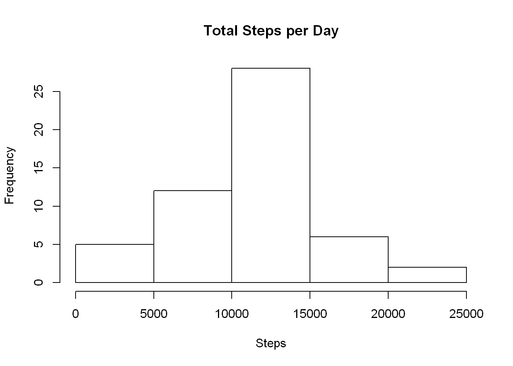
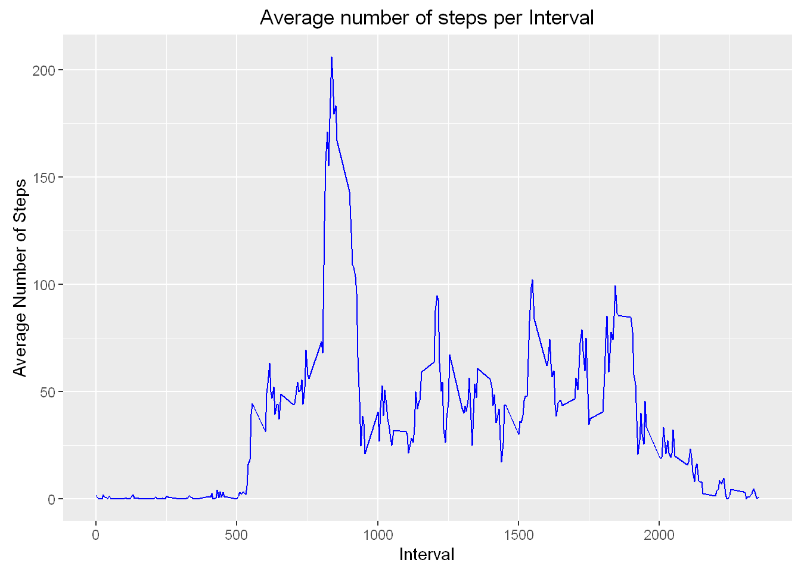
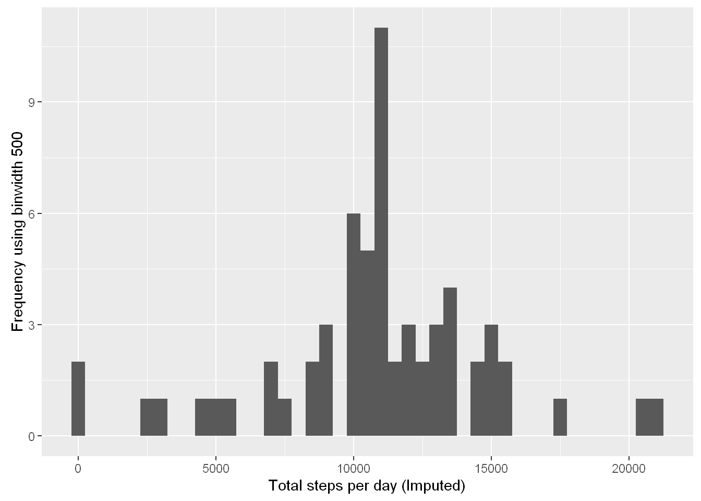
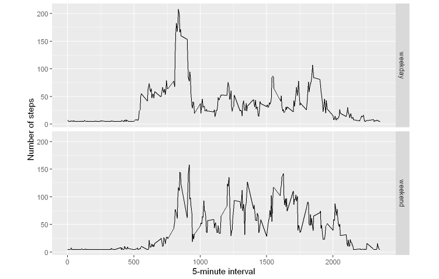

``` r
library(plyr)
library(lubridate)
```

    ## 
    ## Attaching package: 'lubridate'

    ## The following object is masked from 'package:plyr':
    ## 
    ##     here

    ## The following object is masked from 'package:base':
    ## 
    ##     date

``` r
library(ggplot2)
library(scales)
library(Hmisc)
```

    ## Loading required package: lattice

    ## Loading required package: survival

    ## Loading required package: Formula

    ## 
    ## Attaching package: 'Hmisc'

    ## The following objects are masked from 'package:plyr':
    ## 
    ##     is.discrete, summarize

    ## The following objects are masked from 'package:base':
    ## 
    ##     format.pval, round.POSIXt, trunc.POSIXt, units

Loading and preprocessing the data
==================================

``` r
activity <- read.csv("activity.csv",stringsAsFactors = FALSE,header=TRUE, sep=',',colClasses=c("numeric","character","integer"))
```

R Markdown Reading the data into activity data frame and show some summary statistics
-------------------------------------------------------------------------------------

``` r
activity <- read.csv("activity.csv",stringsAsFactors = FALSE)
summary(activity)
```

    ##      steps            date              interval     
    ##  Min.   :  0.00   Length:17568       Min.   :   0.0  
    ##  1st Qu.:  0.00   Class :character   1st Qu.: 588.8  
    ##  Median :  0.00   Mode  :character   Median :1177.5  
    ##  Mean   : 37.38                      Mean   :1177.5  
    ##  3rd Qu.: 12.00                      3rd Qu.:1766.2  
    ##  Max.   :806.00                      Max.   :2355.0  
    ##  NA's   :2304

Convert date to POSIXct clas using lubridate package
----------------------------------------------------

``` r
activity$day <- weekdays(as.Date(activity$date))
activity$DateTime <- as.POSIXct(activity$date,format="%Y-%m-%d")

no_nas <- activity[!is.na(activity$steps),]
str(no_nas)
```

    ## 'data.frame':    15264 obs. of  5 variables:
    ##  $ steps   : int  0 0 0 0 0 0 0 0 0 0 ...
    ##  $ date    : chr  "2012-10-02" "2012-10-02" "2012-10-02" "2012-10-02" ...
    ##  $ interval: int  0 5 10 15 20 25 30 35 40 45 ...
    ##  $ day     : chr  "Tuesday" "Tuesday" "Tuesday" "Tuesday" ...
    ##  $ DateTime: POSIXct, format: "2012-10-02" "2012-10-02" ...

head of no\_nas
---------------

``` r
head(no_nas)
```

    ##     steps       date interval     day   DateTime
    ## 289     0 2012-10-02        0 Tuesday 2012-10-02
    ## 290     0 2012-10-02        5 Tuesday 2012-10-02
    ## 291     0 2012-10-02       10 Tuesday 2012-10-02
    ## 292     0 2012-10-02       15 Tuesday 2012-10-02
    ## 293     0 2012-10-02       20 Tuesday 2012-10-02
    ## 294     0 2012-10-02       25 Tuesday 2012-10-02

What is mean total number of steps per day
==========================================

calculate the total number of steps taken per day
-------------------------------------------------

``` r
sumoftables <- aggregate(activity$steps ~ activity$date,FUN=sum,)

colnames(sumoftables) <- c("Date","Steps")

hist(sumoftables$Steps,breaks=5,xlab="Steps", main="Total Steps per Day")
```



Calculate and report the mean and median of the total \#\# number of steps taken per day
----------------------------------------------------------------------------------------

``` r
meanR <- as.integer(mean(sumoftables$Steps))
medianR <- as.integer(median(sumoftables$Steps))
```

### Mean :

``` r
meanR
```

    ## [1] 10766

### Median :

``` r
medianR 
```

    ## [1] 10765

What is the average daily activity pattern?
-------------------------------------------

``` r
library(dplyr)
```

    ## 
    ## Attaching package: 'dplyr'

    ## The following objects are masked from 'package:Hmisc':
    ## 
    ##     combine, src, summarize

    ## The following objects are masked from 'package:lubridate':
    ## 
    ##     intersect, setdiff, union

    ## The following objects are masked from 'package:plyr':
    ## 
    ##     arrange, count, desc, failwith, id, mutate, rename, summarise,
    ##     summarize

    ## The following objects are masked from 'package:stats':
    ## 
    ##     filter, lag

    ## The following objects are masked from 'package:base':
    ## 
    ##     intersect, setdiff, setequal, union

``` r
interval <- activity %>% 
            filter(!is.na(steps)) %>%
            group_by(interval) %>%
            summarize(steps = mean(steps))

average <- ggplot(interval,aes(x=interval,y=steps))

average + geom_line(color = "blue") + xlab("Interval") + ylab("Average Number of Steps") + ggtitle("Average number of steps per Interval")
```



Maximum steps per interval
--------------------------

``` r
maxSteps <- max(interval$Avg)
```

    ## Warning in max(interval$Avg): no non-missing arguments to max; returning -
    ## Inf

Which interval contains the maximum average number of \#\# steps
----------------------------------------------------------------

``` r
interval[interval$Avg == maxSteps,1]
```

    ## Source: local data frame [0 x 1]
    ## 
    ## Variables not shown: interval (int)

Imputing missing values
=======================

Calculate and report the total number of missing values in the dataset
----------------------------------------------------------------------

``` r
nrow(activity[is.na(activity$steps),])
```

    ## [1] 2304

Devise a strategy for filling in all of the missing
---------------------------------------------------

values in the dataset
---------------------

``` r
dataImputed <- activity
dataImputed$steps <- impute(activity$steps,fun=mean)
```

Histogram of the total number of steps per day
----------------------------------------------

``` r
stepsPerDayImputed <- tapply(dataImputed$steps,dataImputed$date,sum)
qplot(stepsPerDayImputed,xlab="Total steps per day (Imputed)",ylab="Frequency using binwidth 500",binwidth=500)
```



Calculate and report the mean and median total number of steps taken per day
----------------------------------------------------------------------------

``` r
stepsPerDayMeanImputed <- mean(stepsPerDayImputed)
stepsPerDayMedianImputed <- median(stepsPerDayImputed)
```

Mean (imputed):
===============

``` r
stepsPerDayMeanImputed 
```

    ## [1] 10766.19

Median (imputed):
=================

``` r
stepsPerDayMedianImputed 
```

    ## [1] 10766.19

Are there differences in activity patterns between
==================================================

weekdays and weekends
=====================

### 1. Create a new factor variable in the dataset with

### two levels - "weekday" and "weekend" indicating

### whether a given date is a weekday or weekend day

``` r
weekday.or.weekend <- function(date) {
    day <- weekdays(date)
    if (day %in% c("Monday", "Tuesday", "Wednesday", "Thursday", "Friday")) 
        return("weekday") else if (day %in% c("Saturday", "Sunday")) 
        return("weekend") else stop("invalid date")
}
dataImputed$date <- as.Date(dataImputed$date)
dataImputed$day <- sapply(dataImputed$date, FUN = weekday.or.weekend)
```

### 2 Make a panel plot containing a time series plot

``` r
averages <- aggregate(steps ~ interval + day, data = dataImputed, mean)
ggplot(averages, aes(interval, steps)) + geom_line() + facet_grid(day ~ .) + 
    xlab("5-minute interval") + ylab("Number of steps")
```


